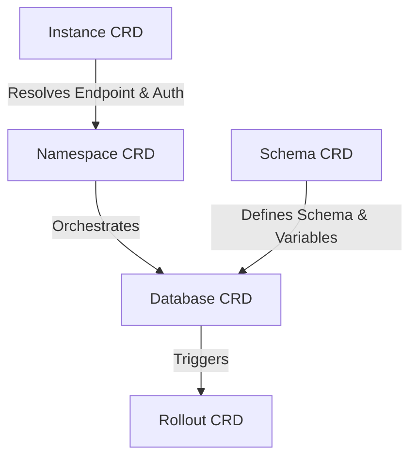

# surreal-dbops

`surreal-dbops` is a cloud-native Kubernetes Custom Controller designed to manage SurrealDB logical structures (Namespaces, Databases, and Schemas) using GitOps principles. By representing your database schema and catalog configuration as custom resources, you can version-control, audit, and automatically roll out database transitions with zero manual intervention.

---

## Key Features

*   **Declarative Schema Management**: Manage SurrealDB schemas via version-controlled Kubernetes Custom Resources.
*   **Variable Interpolation**: Dynamically inject variables (e.g., JWT keys, environment variables, API endpoints) into your schemas using standard Kubernetes `Secret` and `ConfigMap` resources.
*   **Introspective Schema Diffing**: Introspects live database catalogs (`INFO FOR DB`, `INFO FOR TABLE`) to calculate schema diff statements dynamically, ensuring only required changes are applied.
*   **Destructive Change Protection**: Prevent accidental table or field deletions. Destructive schema migrations are automatically blocked and require explicit administrator approval.
*   **Automated Audit Logging**: A Mutating Admission Webhook intercepts manual approvals to record who approved a rollout and when, storing this data directly in Kubernetes resource annotations.
*   **Concurrency & Rate Limiting**: Limit database migrations to run in parallel batches, protecting your clusters from performance hits during massive rollouts.

---

## Architectural Resources (CRDs)

`surreal-dbops` defines five Custom Resource Definitions (CRDs) to model your SurrealDB infrastructure:



1.  **`Instance`**: Defines connection strings and administrator credentials for a SurrealDB cluster.
2.  **`Namespace`**: Binds a logical namespace within SurrealDB to a specific `Instance`.
3.  **`Schema`**: Holds the SurrealQL schema definitions, variables references, and rollout policies.
4.  **`Database`**: Binds a specific `Schema` configuration to a tenant database inside a `Namespace`.
5.  **`Rollout`**: Internal resource generated by the operator to track the diff generation, manual approval locks, and batch execution status of schema updates.

---

## Installation & Deployment

We provide a Helm chart to install the operator, webhook server, and required RBAC rules.

### Prerequisites
*   Kubernetes `v1.26+`
*   `cert-manager` (used to generate TLS certificates for the Mutating Webhook)
*   An active SurrealDB instance

### Deploying the Operator via Helm

```bash
# Add Helm repository (or deploy from local chart)
helm install surreal-dbops ./charts/surreal-dbops \
  --namespace reliquo-system \
  --create-namespace \
  --set webhook.enabled=true \
  --set webhook.certManager.enabled=true \
  --set webhook.certManager.generateCert=true
```

---

## Usage Example

### 1. Declare the SurrealDB Instance and Namespace
```yaml
apiVersion: surreal-dbops.reliquo.io/v1alpha1
kind: Instance
metadata:
  name: main-cluster
  namespace: default
spec:
  connectionString:
    value: http://surrealdb.default.svc.cluster.local:8000
  username:
    value: root
  password:
    valueFrom:
      secretKeyRef:
        name: surrealdb-root-secret
        key: password
---
apiVersion: surreal-dbops.reliquo.io/v1alpha1
kind: Namespace
metadata:
  name: tenant-a
  namespace: default
spec:
  instanceRef:
    name: main-cluster
```

### 2. Declare a Schema with Secrets Interpolation
```yaml
apiVersion: surreal-dbops.reliquo.io/v1alpha1
kind: Schema
metadata:
  name: core-schema
  namespace: default
spec:
  revisionHistoryLimit: 10
  requireApproval: destructive
  schema:
    value: |
      DEFINE TABLE user SCHEMAFULL;
      DEFINE FIELD name ON user TYPE string;
      DEFINE FIELD email ON user TYPE string;
      DEFINE FIELD api_key ON user TYPE string VALUE ${API_KEY};
  variables:
    API_KEY:
      valueFrom:
        secretKeyRef:
          name: third-party-tokens
          key: api-key
```

### 3. Bind the Schema to a Database
```yaml
apiVersion: surreal-dbops.reliquo.io/v1alpha1
kind: Database
metadata:
  name: app-db
  namespace: default
spec:
  namespaceRef:
    name: tenant-a
  schemaRef:
    name: core-schema
```

---

## Approving Destructive Rollouts

If a schema change introduces a destructive operation (e.g., removing a field or table), the generated `Rollout` resource will transition into a `Blocked` phase.

To approve the rollout, annotate the resource:

```bash
kubectl annotate rollout <rollout-name> surreal-dbops.reliquo.io/approved="true" --overwrite
```

The mutating webhook will automatically validate your privileges, record your identity (`surreal-dbops.reliquo.io/approved-by`), add an execution timestamp (`surreal-dbops.reliquo.io/approved-at`), and trigger the migration loop.

---

## Development and Verification

We use a local Kubernetes-in-Docker (KIND) cluster to verify the entire lifecycle.

### Running Unit Tests
```bash
cargo test
```

### Running E2E with Chainsaw
E2E coverage is implemented with [Kyverno Chainsaw](https://kyverno.github.io/chainsaw/latest/) using the explicit test definition approach.

Install and run Chainsaw tests:

```bash
chainsaw test tests/chainsaw
```

The CI workflow provisions KIND, installs dependencies, deploys the operator, and executes the same Chainsaw suite.

Run tests with a JUnit report:

```bash
chainsaw test tests/chainsaw --report-format junit --report-path .chainsaw-report
```

---

## License
Licensed under the MIT License.
